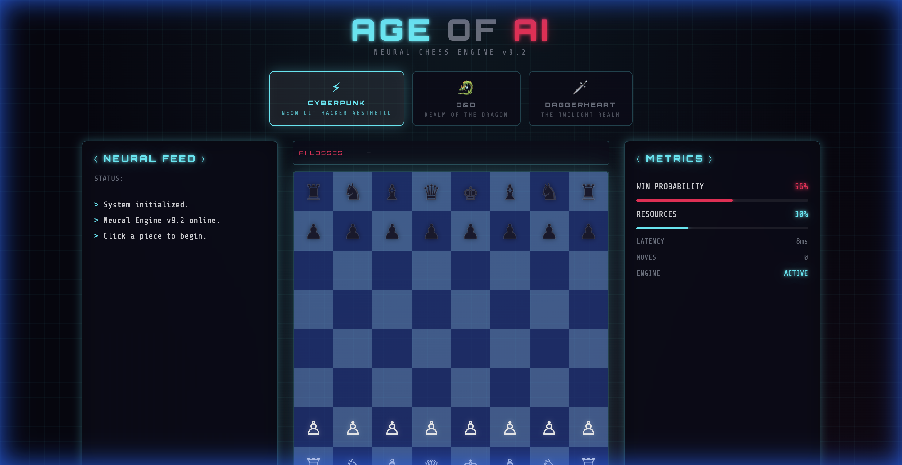
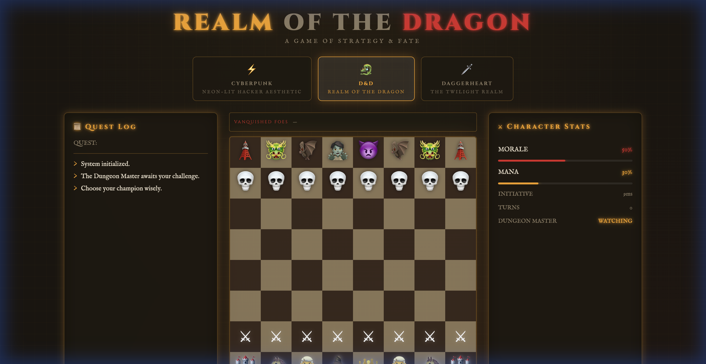
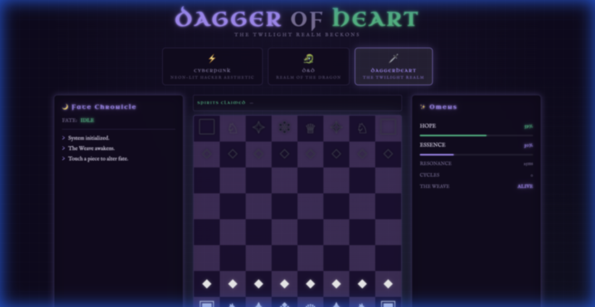
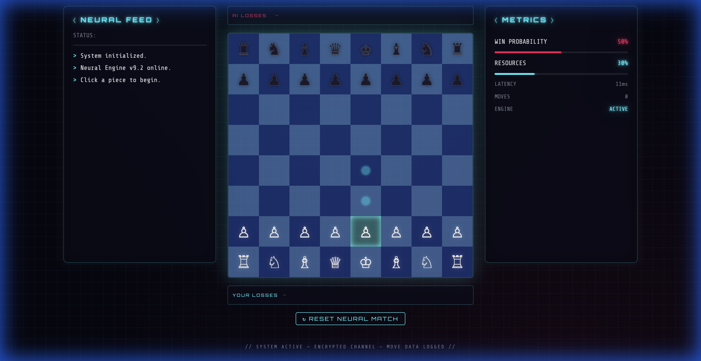
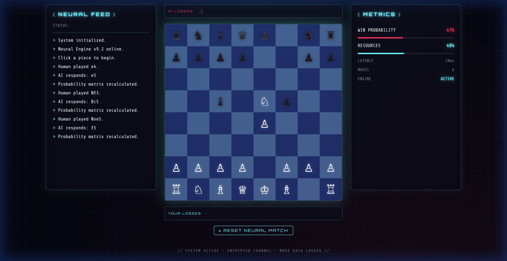

# ⚡ Age of AI — Neural Chess Engine

A futuristic chess web app with multiple immersive board themes. Play against an AI opponent on a custom-built board with real-time game commentary, metrics tracking, and captured pieces display.



## 🎨 Choose Your Realm

Switch between three wildly different visual themes — each with its own color palette, piece icons, fonts, panel names, and AI commentary:

### ⚡ Cyberpunk — *Neon-lit Hacker Aesthetic*
Neon cyan & hot pink on deep black. Orbitron display font, terminal-style Neural Feed, encrypted-channel vibes.

### 🐉 D&D — *Realm of the Dragon*
Warm amber & crimson on dark parchment. Fantasy emoji pieces (🐲🏰🧙💀⚔👑), Quest Log, Character Stats, and Dungeon Master commentary.



### 🗡 Daggerheart — *The Twilight Realm*
Deep violet & emerald on midnight. Mystical symbol pieces (◆✦❖♛), Fate Chronicle, Omens panel, and ethereal prose commentary.



## ✨ Features

- **3 Immersive Themes** — Cyberpunk, D&D, and Daggerheart with live switching
- **Custom Click-to-Move Board** — Select a piece, see legal moves highlighted, click to move
- **AI Opponent** — Plays automatically after each human move
- **Dynamic Commentary** — Theme-specific AI flavor text in the log panel
- **Metrics Panel** — Live stats with theme-appropriate labels
- **Captured Pieces Tracker** — See which pieces each side has lost
- **Responsive Design** — Works on mobile and desktop

## 🎮 How to Play

### 1. Pick a Theme
Click one of the three theme cards at the top to transform the entire experience.

### 2. Select a Piece
Click any white piece to select it. Legal moves appear as glowing dots; capture targets get a colored ring.



### 3. Make Your Move
Click any highlighted square to move. The AI responds within ~1 second with theme-flavored commentary.

### 4. Track Captures
Captured pieces appear above (enemy losses) and below (your losses) the board, sorted by value.



## 🛠 Tech Stack

| Technology | Purpose |
|---|---|
| **Vite** | Build tool & dev server |
| **React 19** | UI framework |
| **chess.js** | Chess logic & move validation |
| **Vanilla CSS** | Theme-driven custom styling via CSS variables |

> **Note:** This project uses a fully custom React chessboard (no `react-chessboard`) for full React 19 compatibility and total visual control.

## 🚀 Getting Started

```bash
# Clone the repo
git clone git@github.com:mr31labs/Age-of-AI-Chess.git
cd Age-of-AI-Chess

# Install dependencies
npm install

# Start the dev server
npm run dev
```

Open [http://localhost:5173](http://localhost:5173) in your browser.

## 📁 Project Structure

```
src/
├── App.jsx       # Game logic, custom board, ThemeSelector, all UI components
├── themes.js     # Theme definitions (colors, fonts, piece maps, labels, flavor text)
├── index.css     # CSS variable-driven responsive styling
└── main.jsx      # React entry point
```

## 📜 License

MIT
