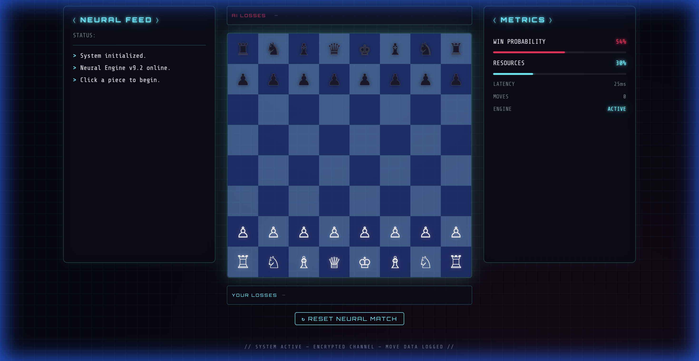

# ⚡ Age of AI — Neural Chess Engine

A futuristic chess web app with a cyberpunk "Age of AI" aesthetic. Play against a neural AI opponent on a custom-built board with real-time game commentary, metrics tracking, and captured pieces display.



## ✨ Features

- **Custom Click-to-Move Board** — Select a piece, see legal moves highlighted, click to move
- **AI Opponent** — Plays automatically after each human move
- **Neural Feed** — Real-time log of moves and AI commentary in a terminal-style panel
- **Metrics Panel** — Live win probability, resource usage, latency, and move counter
- **Captured Pieces Tracker** — See which pieces each side has lost during the match
- **Cyberpunk UI** — Neon glow effects, Orbitron display font, animated grid background, glassmorphism panels

## 🎮 How to Play

### 1. Select a Piece

Click any white piece to select it. The selected square glows cyan, and legal moves appear as dots on valid target squares. Capture targets are shown with a pink ring.


### 2. Make Your Move

Click on any highlighted square to move your piece. The AI will automatically respond within ~1 second.

### 3. Track Captures

As pieces are captured, they appear in the **AI LOSSES** row (above the board) and **YOUR LOSSES** row (below the board), sorted by piece value.


### 4. Reset

Click **↻ RESET NEURAL MATCH** at any time to start a new game.

## 🛠 Tech Stack

| Technology | Purpose |
|---|---|
| **Vite** | Build tool & dev server |
| **React 19** | UI framework |
| **chess.js** | Chess logic & move validation |
| **Vanilla CSS** | Custom cyberpunk styling |

> **Note:** This project does **not** use `react-chessboard` — the board is a fully custom React component using Unicode chess pieces and click-to-move interaction, built to ensure compatibility with React 19.

## 🚀 Getting Started

```bash
# Clone the repo
git clone git@github.com:mr31labs/Age-of-AI-Chess.git
cd Age-of-AI-Chess

# Install dependencies
npm install

# Start the dev server
npm run dev
```

Open [http://localhost:5173](http://localhost:5173) in your browser and start playing.

## 📁 Project Structure

```
src/
├── App.jsx       # Game logic, custom board, AI, all UI components
├── index.css     # Full cyberpunk theme & responsive styles
└── main.jsx      # React entry point
```

## 📜 License

MIT
